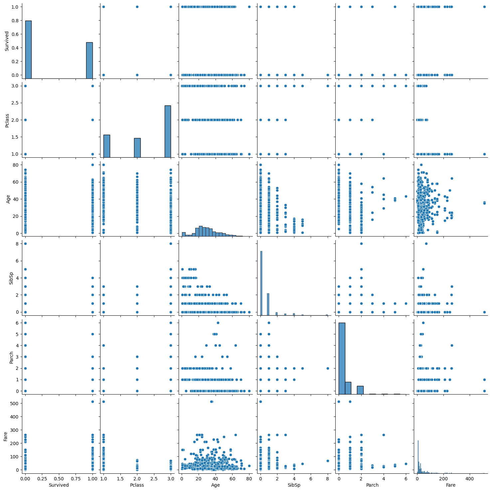

# EXNO2DS
# AIM:
      To perform Exploratory Data Analysis on the given data set.
      
# EXPLANATION:
  The primary aim with exploratory analysis is to examine the data for distribution, outliers and anomalies to direct specific testing of your hypothesis.
  
# ALGORITHM:
STEP 1: Import the required packages to perform Data Cleansing,Removing Outliers and Exploratory Data Analysis.

STEP 2: Replace the null value using any one of the method from mode,median and mean based on the dataset available.

STEP 3: Use boxplot method to analyze the outliers of the given dataset.

STEP 4: Remove the outliers using Inter Quantile Range method.

STEP 5: Use Countplot method to analyze in a graphical method for categorical data.

STEP 6: Use displot method to represent the univariate distribution of data.

STEP 7: Use cross tabulation method to quantitatively analyze the relationship between multiple variables.

STEP 8: Use heatmap method of representation to show relationships between two variables, one plotted on each axis.

## CODING AND OUTPUT
Name : Dhanvant Kumar V

REG NO : 212224040070
```python
import pandas as pd
import numpy as np
import seaborn as sns
import matplotlib.pyplot as plt
```
```python
dt=pd.read_csv("/content/titanic_dataset (2).csv")
dt
```

```python
dt.info()
```

```python
dt.shape
```

```python
dt.set_index("PassengerId",inplace=True)
```
```python
dt.describe()
```

### CATEGORICAL DATA ANALYSIS
```python
dt.nunique()
```

```python
dt["Survived"].value_counts()
```

```python
per = (dt["Survived"].value_counts()/dt.shape[0]*100).round(2)
per
```

### UNIVARIATE ANALYSIS
```python
sns.countplot(data=dt,x="Survived",hue="Survived")
```

```python
dt
```

```python
dt.Pclass.unique()
```

```python
dt.rename(columns={"Sex":"Gender"},inplace=True)
dt
```

### BIVARIATE ANALYSIS
```python
sns.catplot(x="Gender",col="Survived",kind="count",data=dt,height=5,aspect=0.7,hue="Gender")
```

```python
sns.catplot(x="Gender",hue="Survived",data=dt,kind="count")
```

```python
dt.boxplot(column="Age",by="Survived")
```

```python
sns.scatterplot(x=dt["Age"],y=dt["Fare"])
```

```python
sns.jointplot(x="Age",y="Fare",data=dt)
```

### MULTIVARIATE ANALYSIS
```python
fig, ax1 = plt.subplots(figsize=(8,5))
hue_order = dt.Gender.unique()
pt=sns.boxplot(ax=ax1,x="Pclass",y="Age",hue="Gender",hue_order=hue_order,data=dt)
```

```python
sns.catplot(data=dt,col="Survived",x="Gender",hue="Pclass",kind="count")
```

```python
dr=dt.select_dtypes(include='number')
corr=dr.corr()
sns.heatmap(corr,annot=True)
```

```python
sns.pairplot(dr)
```


# RESULT
Thus Exploratory Data Analysis on the given data set was performed successfully.
